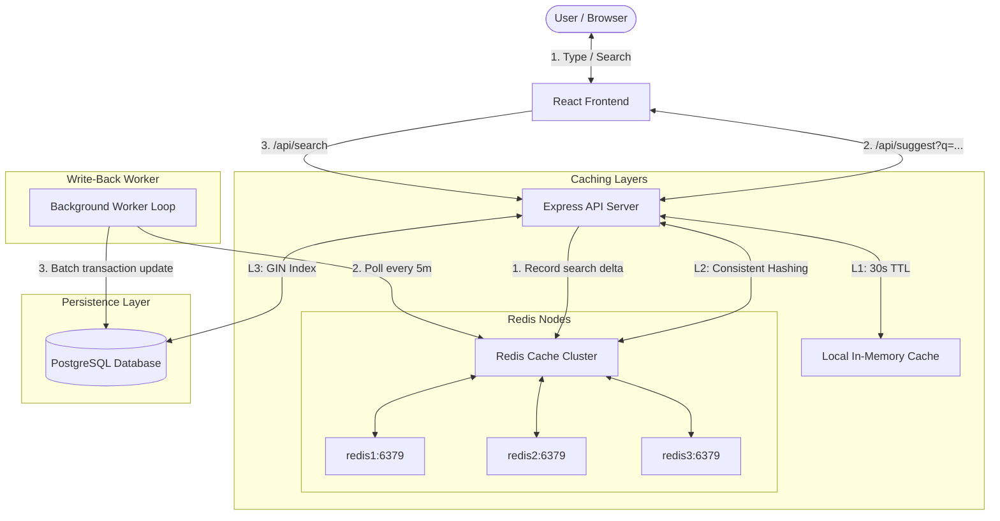

# Scalable Search Typeahead System

A production-grade, highly scalable search typeahead and auto-suggestion system built with a React frontend, Node.js/Express backend, distributed Redis cache cluster, and PostgreSQL database.

---

## 🏗️ System Architecture

This architecture is optimized for **low latency suggestions** (reads) and **high scalability** (writes), preventing database bottlenecks under heavy search traffic.



---

## ⚡ Key Architectural Patterns

### 1. Multi-Tiered Cache (L1 & L2)
* **L1 Cache (In-Memory):** The Express backend uses `lru-cache` to store hot prefixes inside the Node.js process memory for 30 seconds.
* **L2 Cache (Distributed Redis):** If L1 misses, the server queries a distributed Redis cluster. Consistent hashing (via the `hashring` package) determines which node (`redis1`, `redis2`, or `redis3`) stores/retrieves the key, facilitating horizontal cache scaling.
* **L3 DB (PostgreSQL):** Hits only if both L1 and L2 miss. The results are then written back to both caches for future queries.

### 2. Write-Back (Write-Buffered) Popularity Updates
Updating the database on every search query would quickly saturate disk I/O. Instead, this system writes search logs asynchronously:
* When a user searches, `/api/search` increments a count in a Redis hash (`search_deltas`) in memory ($<1$ms operation).
* A background cron/scheduler loop (`processSearchLogs`) triggers every 5 minutes:
  * Pulls the accumulated deltas from Redis.
  * Initiates a PostgreSQL transaction (`BEGIN`).
  * Performs a batched `UPDATE` on the `queries` table to synchronize the popularity scores.
  * Commits the transaction (`COMMIT`) and purges the flushed Redis deltas.

### 3. GIN-Indexed JSONB Prefix Lookups
The PostgreSQL database stores terms, popularity, and pre-calculated prefix arrays in a GIN-indexed `JSONB` column. 
* Prefix lookups use the containment operator (`prefixes ? $1`) which is extremely fast, taking **~21ms** even across millions of rows.
* Queries are aggregated using `GROUP BY final_search_term` to ensure recommendations stay distinct.

---

## 📂 Project Structure

```
TypeAhead/
├── backend/
│   ├── dataset/
│   │   ├── WordFrequency/       # Raw unigram CSV dataset
│   │   └── script_v1.js         # PostgreSQL seeding script
│   ├── Dockerfile               # Node.js backend Docker image
│   ├── docker-compose.yml       # Caching cluster & API compose stack
│   ├── package.json             # Backend dependencies
│   └── server_v1.js             # Main Express API and background worker
└── frontend/
    ├── src/
    │   ├── App.jsx              # Search and trending UI logic
    │   └── main.jsx
    ├── index.html
    └── vite.config.js           # Dev server reverse proxy config
```

---

## 🚀 Getting Started

### Prerequisites
* Docker & Docker Compose
* Node.js & npm (for running frontend/seeding locally)
* PostgreSQL (running on host)

### 1. Database Setup
Ensure PostgreSQL has the `queries` schema initialized:

```sql
CREATE TABLE queries (
    id SERIAL PRIMARY KEY,
    prefixes JSONB NOT NULL,
    final_search_term TEXT NOT NULL,
    popularity INTEGER NOT NULL
);

-- Indexes for performance
CREATE INDEX idx_queries_prefixes ON queries USING gin (prefixes);
CREATE INDEX idx_query_popularity ON queries (popularity DESC);
```

### 2. Seed the Dataset
Load the unigram dataset into your PostgreSQL database:
1. Navigate to `backend/` and verify your credentials in `.env`.
2. Install dependencies:
   ```bash
   npm install
   ```
3. Run the seeder:
   ```bash
   node dataset/script_v1.js
   ```

### 3. Start Caching & Backend API (Docker)
Start the Redis cluster and Express server:
```bash
cd backend/
docker compose up --build
```
The server will start listening on port `3000`.

### 4. Start the Frontend
Start the React/Vite development server:
```bash
cd frontend/
npm install
npm run dev
```
Open `http://localhost:5173` to test the typeahead suggestions!
