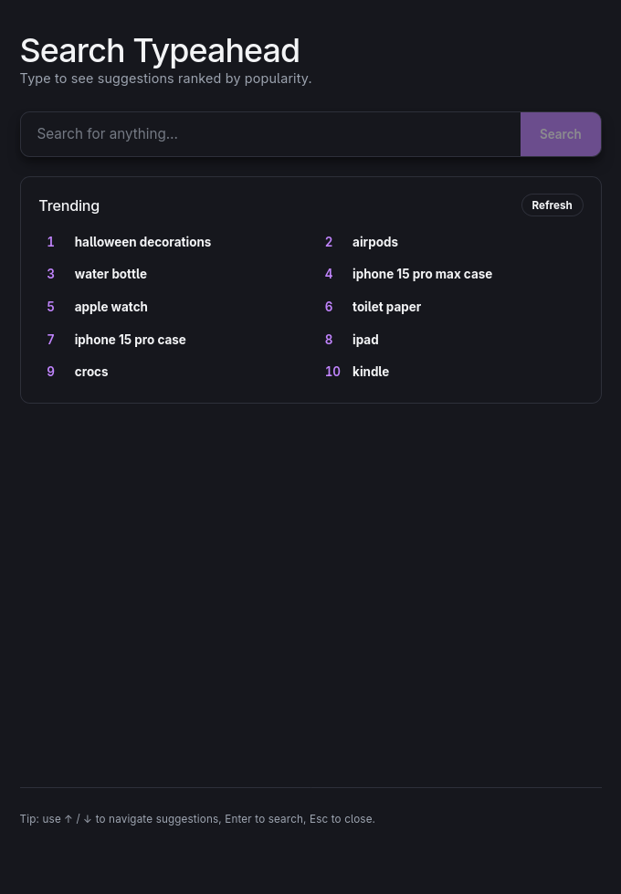
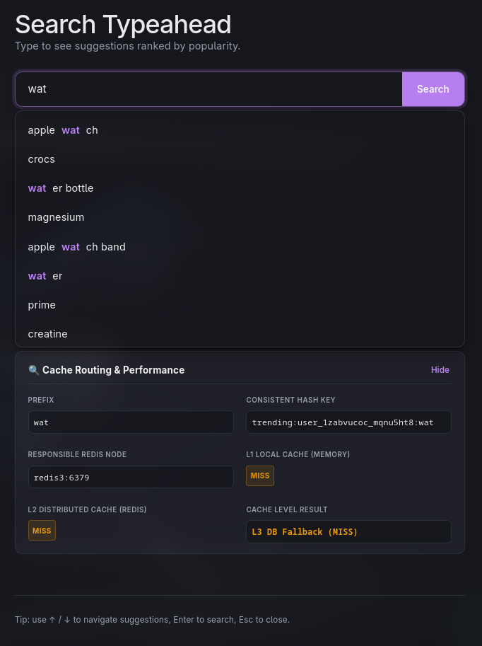
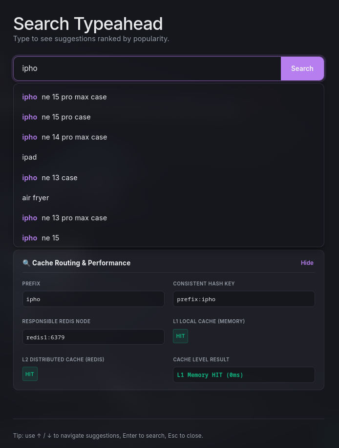
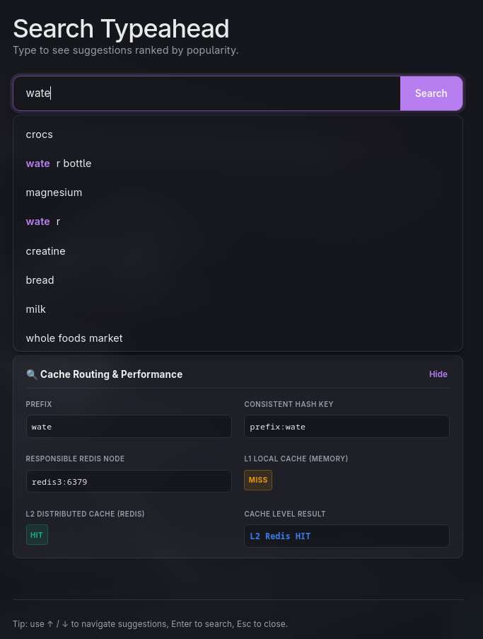

# Scalable Search Typeahead System

A production-grade, highly scalable search typeahead and auto-suggestion system built with a React frontend, Node.js/Express backend, distributed Redis cache cluster, and PostgreSQL database.

---

## 🏗️ System Architecture

This architecture is optimized for **low latency suggestions** (reads) and **high scalability** (writes), preventing database bottlenecks under heavy search traffic.


---

## ⚡ Key Architectural Patterns

### 1. Multi-Tiered Cache (L1 & L2)

* **L1 Cache (In-Memory):** The Express backend uses `lru-cache` to store hot prefixes inside the Node.js process memory for 30 seconds.
* **L2 Cache (Distributed Redis):** If L1 misses, the server queries a distributed Redis cluster. Consistent hashing (via the `hashring` package) determines which node (`redis1`, `redis2`, or `redis3`) stores/retrieves the key, facilitating horizontal cache scaling.
* **L3 DB (PostgreSQL):** Hits only if both L1 and L2 miss. The results are then written back to both caches for future queries.

### 2. Write-Back (Write-Buffered) Popularity Updates

Updating the database on every search query would quickly saturate disk I/O. Instead, this system writes search logs asynchronously:

* When a user searches, `/api/search` increments a count in a Redis hash (`search_deltas`) in memory ($<1$ms operation).
* A background cron/scheduler loop (`processSearchLogs`) triggers every 5 minutes:
  * Pulls the accumulated deltas from Redis.
  * Initiates a PostgreSQL transaction (`BEGIN`).
  * Performs a batched `UPDATE` on the `queries` table to synchronize the popularity scores.
  * Commits the transaction (`COMMIT`) and purges the flushed Redis deltas.

### 3. GIN-Indexed JSONB Prefix Lookups

The PostgreSQL database stores terms, popularity, and pre-calculated prefix arrays in a GIN-indexed `JSONB` column.

* Prefix lookups use the containment operator (`prefixes ? $1`) which is extremely fast, taking **~21ms** even across millions of rows.
* Queries are aggregated using `GROUP BY final_search_term` to ensure recommendations stay distinct.

### 4. Personalized Trending Searches

Trending search suggestions are personalized for short search queries (prefixes of length `<= 3` or empty):

* **Client Identification:** A unique, persistent user ID is generated in the browser's `localStorage` and sent in the `X-User-ID` request header.
* **User Search History:** Searches are tracked in real-time in a user-specific Redis sorted set (`user:${userId}:searches`) with a 30-day TTL.
* **Score Normalization:** Because raw user search counts (typically 1–10) are dwarfed by global popularity metrics (thousands or millions), the system normalizes both scales to `[0, 1]` on cache miss.
* **Recommendation Formula:** Suggestions are sorted using a weighted recommendation model:
  $$\text{Score} = 0.8 \times \text{NormalizedGlobal} + 0.2 \times \text{NormalizedUser}$$
  This dynamically balances local user interest with global search trends.

### 5. Real-Time Cache Routing Debugger

A debugging endpoint `/api/cache/debug` and a corresponding frontend dashboard are implemented to trace cache behavior:

* Identifies which of the Redis nodes (`redis1`, `redis2`, or `redis3`) is responsible for a given search prefix using the consistent hash ring.
* Probes both L1 (local Express cache) and L2 (the target Redis node cache) to verify cache hits and misses in real time.

---

## 📂 Project Structure

```
TypeAhead/
├── backend/
│   ├── dataset/
│   │   ├── WordFrequency/       # Raw unigram CSV dataset
│   │   └── script_v1.js         # PostgreSQL seeding script
│   ├── Dockerfile               # Node.js backend Docker image
│   ├── docker-compose.yml       # Caching cluster & API compose stack
│   ├── package.json             # Backend dependencies
│   └── server_v1.js             # Main Express API and background worker
└── frontend/
    ├── src/
    │   ├── App.jsx              # Search and trending UI logic
    │   └── main.jsx
    ├── index.html
    └── vite.config.js           # Dev server reverse proxy config
```

## 📸 Feature Showcases & Screenshots

### 1. Zero-State Global Trending Search
When no search prefix is entered (or when the input is focused), the user is presented with a list of the top 10 globally trending search terms.



### 2. Personalized Suggestions (Prefix length <= 3)
For queries of length `<= 3` (e.g. `wat`), the caching key becomes personalized (`trending:user_xxx:wat`), and the ranking combines global popularity with the user's local search frequency. Here, a query for `wat` results in an L3 Cache Miss and falls back to PostgreSQL (L3 DB Fallback):



### 3. L1 Local Memory HIT (Prefix length > 3)
For standard queries of length `> 3` (e.g. `ipho`), if the results are already cached inside the Express Node.js process memory, the response returns instantly (0ms latency):



### 4. L2 Distributed Redis HIT (Prefix length > 3)
If the query is not in the L1 memory cache but is cached inside the distributed Redis node, the Cache Debugger details the hit status and the specific Redis node responsible for the hash key:



---

## 🚀 Getting Started

### Prerequisites

* Docker & Docker Compose
* Node.js & npm (for running frontend/seeding locally)
* PostgreSQL (running on host)

### Dataset

  Recommended Dataset: AmazonQAC dataset (available on huggingface)  
  Link to the dataset: <https://huggingface.co/datasets/amazon/AmazonQAC>  
  This dataset is very very large. It is recommended to download and use only the parts of the dataset.  
  (I used part 0 of this dataset. That has a size of 3 GB, damn...)

### 1. Database Setup

Ensure PostgreSQL has the `queries` schema initialized:

```sql
CREATE TABLE queries (
    id SERIAL PRIMARY KEY,
    prefixes JSONB NOT NULL,
    final_search_term TEXT NOT NULL,
    popularity INTEGER NOT NULL
);

-- Indexes for performance
CREATE INDEX idx_queries_prefixes ON queries USING gin (prefixes);
CREATE INDEX idx_query_popularity ON queries (popularity DESC);
```

### 2. Seed the Dataset

Load the unigram dataset into your PostgreSQL database:

1. Navigate to `backend/` and verify your credentials in `.env`.
2. Install dependencies:

   ```bash
   npm install
   ```

3. Run the seeder:

   ```bash
   node dataset/script_v1.js
   ```

### 3. Start Caching & Backend API (Docker)

Start the Redis cluster and Express server:

```bash
cd backend/
docker compose up --build
```

The server will start listening on port `3000`.

### 4. Start the Frontend

Start the React/Vite development server:

```bash
cd frontend/
npm install
npm run dev
```

Open `http://localhost:5173` to test the typeahead suggestions!
